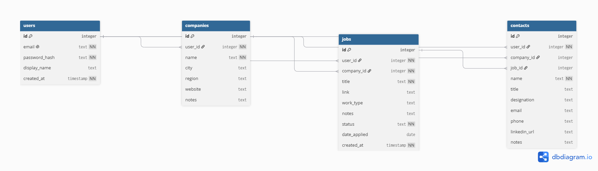

# SQL_TESTING.md
## Project Milestone 5: SQL Design
**Project:** Prospex (Job Search Tracker)

**Team:** CSPB 3308 Group 3

**Purpose:** Database design and testing specification for developers

---

## Overview

This document describes the database design for Prospex: the tables, their fields and constraints, how they relate, the functions used to access the data, and the tests that verify each piece. It is written for the developers building the Flask backend and pages, so they can build against one agreed design.

**Database:** SQLite

**Accessed from:** Flask backend via Python's built-in `sqlite3` module, through a data access layer of Python functions that hide the SQL 

### Design Decisions

| Decision | Choice | Reason |
|---|---|---|
| Login | Users log in with email; email is UNIQUE and lowercased by the app before saving or lookup | Realistic, and allows password reset later; lowercasing prevents duplicate accounts that differ only by case |
| Jobs table | One `jobs` table. Status defaults to 'saved'; `date_applied` is nullable | Applying only adds a date and a status change, so a separate applications table would hold almost nothing |
| Status | Column on `jobs` with a CHECK constraint: saved, applied, interviewing, offer, rejected, accepted, declined, withdrawn | Short, fixed list with no data of its own; CHECK blocks invalid values at the database level |
| Companies | `companies` table referenced by `jobs` and `contacts`; UNIQUE per user on name | Reliable "who I know at this company"; prevents duplicate company names per user |
| Adding companies | App handles "pick existing or add company": the route looks up the company by name and creates it if missing, in the same transaction as the job insert | Keeps business logic in the app, not in database triggers |
| Contacts in MVP | Yes. Each contact has an optional link to one job, plus a designation (e.g., referrer, recruiter, interviewer, hiring manager) | The vision promises tracking "applications and connections"; one job per contact keeps the MVP simple |
| Deleting a user | ON DELETE CASCADE to all of their rows | Deleting an account removes all of that user's data |
| Deleting a company | ON DELETE RESTRICT | Blocks deleting a company that still has jobs or contacts, so job history can't be wiped by accident |
| Deleting a job | Contacts' `job_id` is SET NULL | The person stays in the user's network even if the job is removed |
| Contacts without a company | Allowed (`company_id` nullable) | Covers people met at meetups or events with no company tie |
| Location and work type | `city` and `region` on `companies`; `work_type` (remote, hybrid, in person) on `jobs` | Location is recorded once per company; work arrangement varies by job |
| Date applied | `date_applied` is nullable and set or edited manually by the user; no CHECK ties it to status | Users often log applications after the fact, so they need full control of the date; keeps the schema simple |
| Status history | Stretch goal (see below) | Adds a table beyond the agreed MVP scope |
| File uploads (CV, cover letter) | Stretch goal; would add a `documents` table (one job, many documents) | Upload handling and storage on free hosts is a project of its own |
| Database | SQLite | Matches Lab 7, so the whole team will know it; no install needed; fresh test databases are easy to create in unit tests |
| Foreign key enforcement | Every connection runs `PRAGMA foreign_keys = ON` | SQLite ignores foreign keys by default; without this, CASCADE, RESTRICT, and SET NULL silently do nothing |
| Primary keys | Explicit `id INTEGER PRIMARY KEY` on every table | Auto-generates ids without relying on SQLite's implicit rowid |
| Naming convention | Plural snake_case table names; primary key `id`; foreign keys `<singular table>_id` (e.g., `user_id`) | Standard practice; consistent across all tables |
| Data ownership | Every `companies`, `jobs`, and `contacts` row references `users.id` | Users only ever see their own data |

### Known Trade-offs (MVP)
- SQLite stores the database as a file on the server. Some free hosts wipe local files on restart or redeploy, so the deployment setup must keep the file (revisit when the course covers cloud deployment). A seed script will rebuild demo data in one command.
- A contact linked to more than one job must be entered twice (a `job_contacts` join table would fix this later).
- Only the applied date is stored, not when other status changes happened (see Stretch: Status History).
- A user must delete or move a company's jobs and contacts before deleting the company itself.
- Location is stored once per company, not per job. Jobs at a company's other offices can't show their own city (a per-job location field would fix this later).

### Stretch: Status History (possible addition)
Records the date of every status change, which enables stats like time from applied to interview.

**What would change:**
- **New table `job_status_history`:** one row per status change.
  - `id`: INTEGER, primary key
  - `job_id`: INTEGER, FK → `jobs.id`, NOT NULL, ON DELETE CASCADE
  - `status`: TEXT, NOT NULL, same CHECK list as `jobs.status`
  - `changed_at`: DATE, NOT NULL, DEFAULT today; editable, since users often log a change after it happened
- **`jobs.date_applied` would be removed.** The applied date becomes the history row where status = 'applied'. Storing it in both places lets them disagree.
- **`jobs.status` stays** as the current status, so dashboard queries don't need to search the history.
- **The app writes two rows on every status change:** it updates `jobs.status` and inserts a history row, in one transaction.
- **A history row is inserted when a job is created,** with status 'saved'.
- **New access methods and tests:** e.g., get the history for a job, plus a test that a status change creates exactly one history row.

### Entity Relationship Diagram

[View and edit on dbdiagram.io](https://dbdiagram.io/d/Prospex-database-schema-SQLite-6ac692d3a5ab28041913c48e)

---

# Database Tables

Tables in the MVP:
- `users`
- `companies`
- `jobs`
- `contacts`

### Relationships Summary
- A user has many companies, jobs, and contacts.
- A company has many jobs and many contacts.
- Each job belongs to one company.
- A job has zero or more contacts.
- A contact has zero or one job, and zero or one company.

---

## 1) Table: users

### Table Description
Stores individual users so that only an individuals own data is available to them. 

### Fields
| Field Name | Type | Description | Constraints |
|---|---|---|---|
| id | INTEGER | [auto-incremented id code ] | PRIMARY KEY (auto-generated) |
| email | TEXT | [  the user's email address] | NOT NULL, UNIQUE; lowercased by the app |
| password_hash | TEXT | [hashkey to password for login ] | NOT NULL |
| created_at | TIMESTAMP | [records date of user creation ] | NOT NULL, DEFAULT current timestamp |

### Relationships
- One-to-many with `companies`, `jobs`, and `contacts` (ON DELETE CASCADE)

### Table Tests

1. Insert a valid user succeeds
2. Insert user with missing email fails
3. Insert user with missing password hash fails
4. Insert user with an existing email fails
5. New user gets an auto-generated id and created_at
6. Deleting a user deletes their companies, jobs, and contacts (CASCADE)

---

## 2) Table: jobs

### Table Description
Stores individual jobs entered by the user.

### Fields
| Field Name | Type | Description | Constraints |
|---|---|---|---|
| id | INTEGER | auto-incremented id code | PRIMARY KEY (auto-generated) |
| user_id | INTEGER | id of the user that added job | FK → users.id, NOT NULL, ON DELETE CASCADE |
| company_id | INTEGER | id of company offering job | FK → companies.id, NOT NULL, ON DELETE RESTRICT |
| title | TEXT | job title | NOT NULL |
| link | TEXT | link to the post for added job | Nullable |
| work_type | TEXT | indicates remote work status of job | Nullable, CHECK (remote, hybrid, in person) |
| notes | TEXT | space for any notes a user wants to add | Nullable |
| status | TEXT | application status for job | NOT NULL, DEFAULT 'saved', CHECK (saved, applied, interviewing, offer, rejected, accepted, declined, withdrawn) |
| date_applied | DATE | date application sent | Nullable; entered or edited manually by the user |
| created_at (optional) | TIMESTAMP | job creation date | NOT NULL, DEFAULT current timestamp |

### Relationships
- Many-to-one with `users`
- Many-to-one with `companies`
- One-to-many with `contacts`

### Table Tests

1. Insert a valid job succeeds
2. Insert job with missing title fails
3. Insert job with missing company_id fails
4. Insert job with a company_id that doesn't exist fails
5. Insert job with a user_id that doesn't exist fails
6. Insert job with no status gets 'saved' by default
7. Insert job with a status not on the list fails
8. Insert job with a work_type not on the list fails
9. Insert job with no date_applied, link, notes, or work_type succeeds
10. Deleting a job keeps its contacts but clears their job_id (SET NULL)

---

## 3) Table: contacts

### Table Description
Stores network contacts that can be associated with specific jobs

### Fields
| Field Name | Type | Description | Constraints |
|---|---|---|---|
| id | INTEGER | auto-incremented id code | PRIMARY KEY (auto-generated) |
| user_id | INTEGER | id of user adding contact | FK → users.id, NOT NULL, ON DELETE CASCADE |
| company_id | INTEGER | id of company contact is from | FK → companies.id, nullable, ON DELETE RESTRICT |
| job_id | INTEGER | job associated with contact | FK → jobs.id, nullable, ON DELETE SET NULL |
| name | TEXT | name of contact | NOT NULL |
| title | TEXT | job title of contact | Nullable |
| designation | TEXT | role of contact re. job appication | Nullable, CHECK (recruiter, referrer, interviewer, hiring manager, other) |
| email | TEXT | contact email address | Nullable (not unique) |
| phone | TEXT | contact phone number | Nullable; stored as text to keep +, dashes, parentheses |
| linkedin_url | TEXT | contact LinkedIn link  | Nullable |
| notes | TEXT | space for notes about the contact a user would like to add | Nullable |

### Relationships
- Many-to-one with `users`
- Many-to-one with `companies` (optional)
- Many-to-one with `jobs` (optional; link cleared if the job is deleted)

### Table Tests

1. Insert a valid contact succeeds
2. Insert contact with missing name fails
3. Insert contact with only a name (no company, job, or contact info) succeeds
4. Insert contact with a company_id that doesn't exist fails
5. Insert contact with a job_id that doesn't exist fails
6. Insert contact with a designation not on the list fails
7. Two contacts with the same email succeed (email is not unique)

---

## 4) Table: companies

### Table Description
Stores companies offering jobs in jobs table

### Fields
| Field Name | Type | Description | Constraints |
|---|---|---|---|
| id | INTEGER | auto-incremented id code | PRIMARY KEY (auto-generated) |
| user_id | INTEGER | id of user adding company | FK → users.id, NOT NULL, ON DELETE CASCADE |
| name | TEXT | Company name | NOT NULL; UNIQUE together with user_id |
| city | TEXT | City where company is located | Nullable |
| region | TEXT | region where company is located | Nullable; state, province, or country (works for non-US locations) |
| website | TEXT | company website | Nullable |
| notes | TEXT | space for notes about company a user would add | Nullable |

### Relationships
- Many-to-one with `users`
- One-to-many with `jobs` and `contacts` (ON DELETE RESTRICT)

### Table Tests

1. Insert a valid company succeeds
2. Insert company with missing name fails
3. Insert company with a user_id that doesn't exist fails
4. Insert a company name the same user already has fails
5. Two different users can each have a company with the same name
6. New company gets an auto-generated id
7. Deleting a company that still has jobs fails (RESTRICT)
8. Deleting a company that still has contacts fails (RESTRICT)
9. Deleting a company with no jobs or contacts succeeds

---

# Data Access Methods

<!--
Need at least one per table. Derive them from the user stories:
for each page/story, what query does it run? Each one becomes a method here.
Test each for: normal case, empty case, and "cannot see another user's data".
-->

---

## Access Method: [name]

### Description
[ ]

### Parameters
- [name] ([type])

### Return Values
- [ ]

### Used By
- [Page(s) / user story #]

### Tests

**Use Case Name:** [ ]
**Pre-conditions:** [ ]
**Test Steps:**
1. [ ]

**Expected Result:** [ ]
**Actual Result:** Pending
**Status:** Pending

---

## Access Method: [name]

### Description
[ ]

### Parameters
- [ ]

### Return Values
- [ ]

### Used By
- [ ]

### Tests

**Use Case Name:** [ ]
**Pre-conditions:** [ ]
**Test Steps:**
1. [ ]

**Expected Result:** [ ]
**Actual Result:** Pending
**Status:** Pending

---

# Page-to-Database Mapping

<!-- Coordinate with the Milestone 4 page designs. -->

| Page | Tables Accessed | Access Methods Used |
|---|---|---|
| [Login / Signup] | | |
| [Dashboard] | | |
| [Add / Edit Job] | | |
| [ ] | | |

---

# Page Data Access Tests

**Use Case Name:** [ ]
**Description:** [ ]
**Pre-conditions:** [ ]
**Test Steps:**
1. [ ]

**Expected Result:** [ ]
**Actual Result:** Pending
**Status:** Pending
**Post-conditions:** [ ]

---

## Open Questions for the Team
- Approve a contacts user story, e.g.: As a user, I want to save the people I meet during my search and link them to a job, so I remember who referred or interviewed me.

