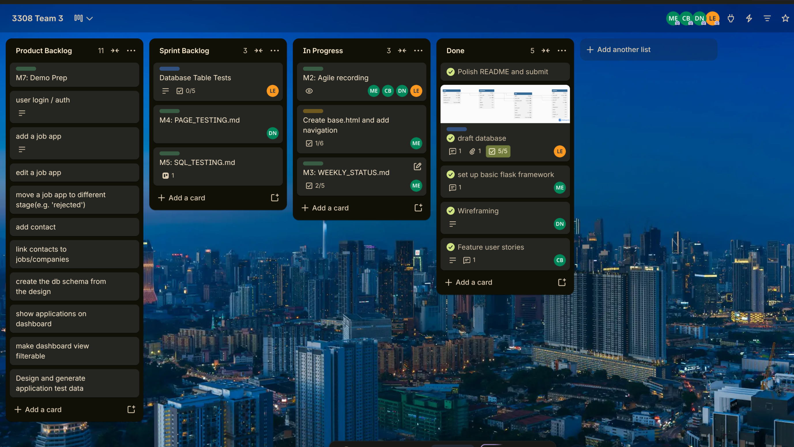

# WEEKLY_STATUS.md
## Project Milestone 3: Weekly Status Report

# Weekly Status: Prospex (Team 3)

---

## October 7 Sprint 1 Review

**Meeting:** October 7, 3pm MT, 30 Minutes, Zoom. Scrum master: Dane Neves

**Sprint Goal:** Draft database, Wireframe, Get Flask Skeleton running, Create user stories. 

| Team member | Completed this sprint | Plan for next Sprint | Blocks |
| --- | --- | --- | --- | 
| Matthew Etter | Flask Skeleton, login/logout, profile route | base template and navigation, README run steps, WEEKLY STATUS.md | Away till the 13th |
| Connor Brown | Created Detailed User Stories| Create Sample Test Data set  | None |
| Leeza Etzenhouser | SQL design doc: Tables and constraints and ER Diagram| Write db tests| None |
| Dane Neves | Wireframes for each page of application | Begin work on PAGE_TESTING.md | None | 

**Decisions** Switched to SQLite from MySQL because it better matches class stack.

**Risks** Difficulty integrating tests/ pages/ db

**Retro:** 
- Went well: PRs reviewed, code merged and working, design docs reviewed and discussed
- Didn't work: Not using Trello to potential
- Changing next sprint: Using Trello for communication more, assign members to cards and use cheklists

